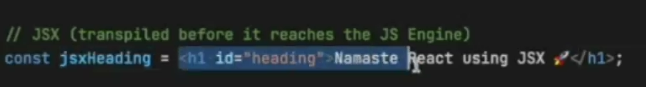

Here's a simple explanation of the commands you listed:

npm init:

Initializes a new Node.js project and creates a package.json file. It will prompt you to enter information like the project name, version, etc.

<!-- #################### -->

npm init -y:

This is the same as npm init, but it automatically accepts the default settings (creates package.json without asking any questions).

<!-- ################### -->

npm i react:

Installs React library in your project and adds it to the dependencies in your package.json.

<!-- #################### -->

npm i react-dom:

Installs the ReactDOM library (used to render React components in the browser) and adds it to the dependencies in your package.json.

<!-- ######################## -->

npm i -D parcel:

Installs Parcel (a bundler for your code) as a devDependency (-D flag) in your package.json. This means Parcel is only needed for development (not production).

<!-- ########################### -->

npx parcel index.html:

Runs Parcel bundler using npx (which comes with npm) and starts a development server by bundling and serving your index.html file. This allows you to view your app in the browser.

🚀
